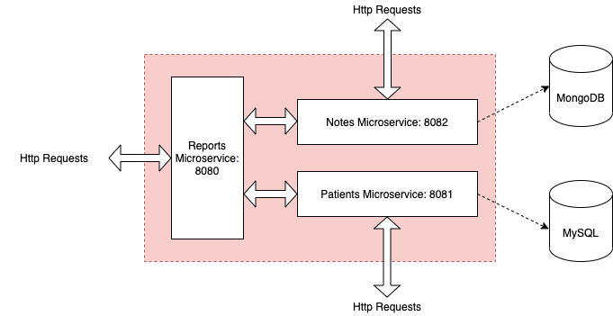

# P10_mediscreen_reports

## Technical
* Framework: Spring Boot 2.4.3
* Java 1.1
* Gradle 6.6.1
* Jacoco 0.8.4
* Docker

## Structure
The application is divided into three microservices for the following tasks:
1. https://github.com/toastnjamz/P10_mediscreen_patients: manages patient demographic information stored in MySQL DB
2. https://github.com/toastnjamz/P10_mediscreen_notes: manages patient history/practitioner notes stored in Mongo DB
3. https://github.com/toastnjamz/P10_mediscreen_reports: calculates a patient's risk for diabetes based on their demographic informaiton and note history

## Architectural Overview

